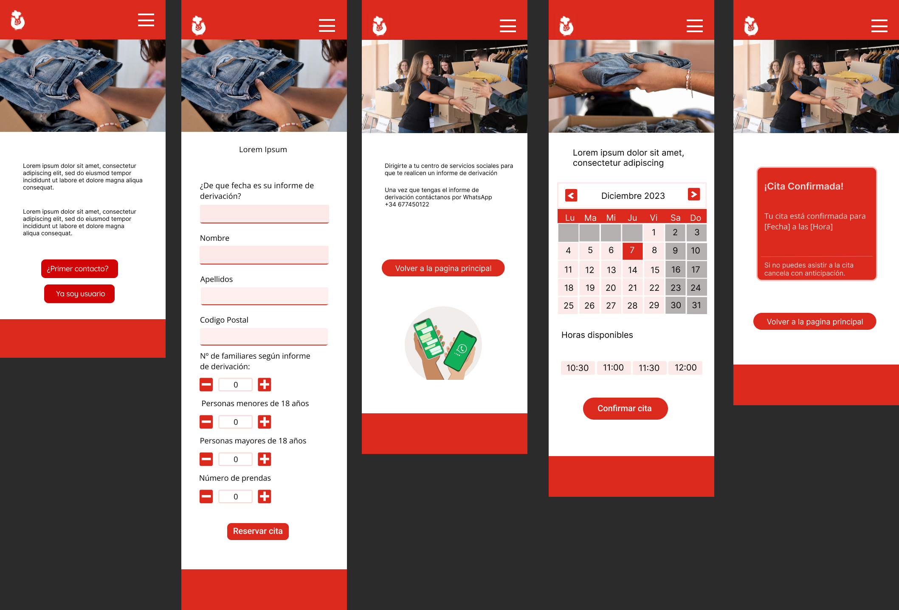
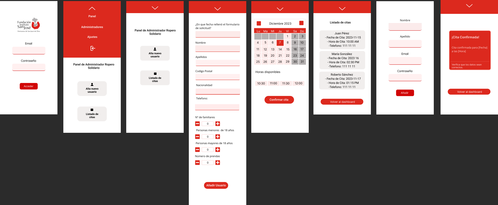

# Armario San José - Ropero Solidário

Armario San José - Ropero Solidario es una iniciativa de la [Fundación San José](https://fundacioninstitutosanjose.com/), en colaboración con Carrefour y Carrefour España, que gestiona un ropero solidario desde 2017. Este servicio está destinado a personas con pocos recursos, ofreciendo prendas de ropa nuevas donadas.

Los usuarios deben contar con un informe de servicios sociales que se actualiza cada 6 meses para verificar su situación económica.
## Objetivo Armario San José

El objetivo principal es brindar apoyo a personas necesitadas, proporcionándoles ropa nueva a través de un proceso eficiente y solidario. El proyecto simplifica y automatiza la gestión de citas, mejorando con eficiencia y accesibilidad la atención a aquellos que requieren ayuda.

## Requisitos del Proyecto

- Actualizar Informe: Verificar antigüedad de los informes;
- Formulario Accesible: Incorporar un formulario sencillo para la participación en el programa;
- Gestión de Citas: Integrar un sistema de reserva de citas directamente en la aplicación;
- Corrección Automática de Datos: La corrección automática de datos actualizará la base de datos del usuario;
- Vista del Administrador: Ofrecer una gestión completa de la aplicación.

## Diseño de Interfaz

El diseño de la interfaz de la página se llevó a cabo utilizando la herramienta Figma, con un enfoque en la creación de una experiencia sencilla y amigable para los usuarios. 







## Flujo de la Página del Usuario

    Home: En la página principal contiene informaciones acerca del proyecto y dos botones, 
    uno de ellos es seleccionar "¿Primer Contacto?" para obtener información de contacto por WhatsApp.
    
    Usuario Existente: Acceder a "¡Ya Soy Usuario!" Contiene un formulario para rellenar con informaciones 
    encontradas en su informe de servicio social.
   
    Calendario: Seleccionar fechas y horarios disponibles según su disponibilidad.
    
    Confirmación de Cita: Recibir una notificación de confirmación con un ID único. 
    El usuario puede usar este número para modificar la cita si es necesario.
## Flujo de la Página del Administrador

    Inicio de Sesión: Acceder con email y contraseña.
    
    Gestión de Usuarios: Añadir nuevos usuarios a la base de datos y agendar citas.
    
    Lista de Citas Confirmadas: Visualizar todas las citas confirmadas y filtrar por fecha.
    
    Horarios Disponibles: Elegir otros horarios para que estén disponibles en el calendario del usuario.
    
    Creación de Administradores: Crear otros administradores para acceder al dashboard.
## Tecnologías Utilizadas

**Client:** React, Typscript, Vite, React Router, React Bootstrap,FontAwesome, Moment.js.

**Server:** Node.js, Typscript, Express, Sequelize, MySQL2, JWT, Bcrypt, Dotenv, Cors.
## Repositorio y Dependencias

Clonar el repositorio:

```bash
  git clone <https://github.com/Wannda-Abreu/ropero-solidario.git>
  ```
Cliente:

```bash
  cd client
```
Instalar dependencias:
```bash
  npm install
```

Ejecutar la aplicación en modo de desarrollo:

```bash
  npm run dev
```


Servidor:

```bash
  cd server
```

Instalar dependencias:

```bash
  npm install
```

Ejecutar la aplicación en modo de desarrollo:

```bash
  npm run dev
```
## Teste


```bash
  npm run test
```


## Developers

- [Wanda Abreu](https://github.com/Wannda-Abreu) - Scrum 

- [Jorge de León ](https://github.com/Giorgidlc) - Product Owner

- [Pedro Martínez](https://github.com/Pdromtinez) - Developer

- [Thuanny Chagas ](https://github.com/thuchagas) - Developer

- [Victor Nash](https://github.com/Victor-Nash) - Developer

